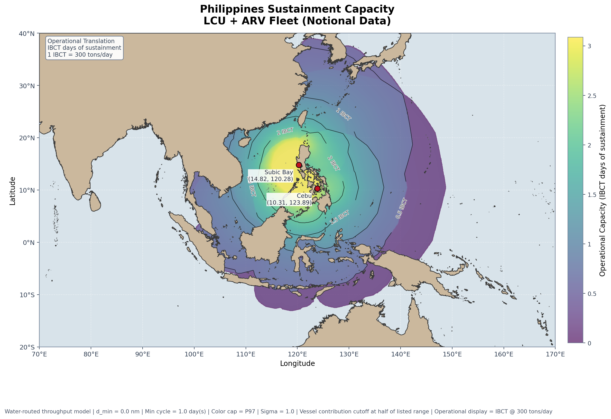

# Maritime Reach Map Generator

`maritime_reach_map.py` generates static PNGs showing maritime operational reach or theater sustainment throughput while treating land as an impassable barrier. This allows sustianment planners to visualize their distribution network's capacity in real operational geometry



The preferred interface is now a YAML scenario file. One scenario can define hubs, vessel types, model settings, visualization defaults, and multiple outputs to render in a single run.

## Setup

The repo already includes the Natural Earth land dataset under `data/ne_10m_land/`, so a fresh workstation only needs Python and the packages in `requirements.txt`.

Recommended clean install:

```bash
python3 -m venv .venv
source .venv/bin/activate
pip install -r requirements.txt
```

Alternative install matching the local setup used during development:

```bash
pip install --target .vendor -r requirements.txt
```

Notes:

- The script automatically adds `.vendor/` to `sys.path` if that folder exists.
- The script sets a local Matplotlib config/cache directory under `.mplconfig/`.
- YAML scenario loading requires `PyYAML`, which is now included in `requirements.txt`.

## YAML Scenarios

The repo includes:

- `defaults.yaml`: baseline map, model, and visualization settings.
- `scenarios/philippines_distribution.yaml`: example scenario with multiple outputs.

Run the example scenario:

```bash
python3 maritime_reach_map.py --config scenarios/philippines_distribution.yaml
```

That single command renders every entry under `outputs:` in the scenario file.
Relative `filename` values from YAML scenarios are written under the repo-level `output/` directory.

Scenario files can define:

- `scenario`: metadata such as `name`, `title`, and `subtitle`
- `map`: `grid_km`, `projection`, `bounding_box`, and `land_shapefile`
- `model`: routing settings, distance caching, default range, and minimum cycle time
- `vessels`: named vessel types
- `hubs`: locations plus fleet composition by vessel type
- `visualization`: map colors, font family, figure size, throughput settings, and hub-label behavior
- `outputs`: one or more `range_map` or `throughput_field` products with per-output titles, subtitles, bounding boxes, filenames, and overrides

Minimal run pattern:

```bash
python3 maritime_reach_map.py --config path/to/scenario.yaml
```

Optional defaults override:

```bash
python3 maritime_reach_map.py \
  --config path/to/scenario.yaml \
  --defaults-config path/to/defaults.yaml
```

## Legacy CLI

The older flag-based interface still works for single-output runs.

Reach map:

```bash
python3 maritime_reach_map.py \
  --hub 14.829 120.283 \
  --hub -12.400 130.800 \
  --range-nm 2000 \
  --output maritime_reach_map.png
```

Throughput map:

```bash
python3 maritime_reach_map.py \
  --output-mode throughput \
  --hub 14.829 120.283 \
  --hub 13.444 144.657 \
  --hub-vessel 1 100 16 2000 \
  --hub-vessel 1 50 22 1500 \
  --hub-vessel 2 80 15 2600 \
  --min-cycle-days 1.0 \
  --colormap viridis \
  --heatmap-alpha 0.65 \
  --color-percentile 97 \
  --heatmap-sigma 1.0 \
  --throughput-contours 5 10 25 50 75 100 \
  --output output/maritime_throughput_map.png
```

`--hub-vessel` takes `HUB_INDEX PAYLOAD_TONS SPEED_KNOTS RANGE_NM` and can be repeated to model multiple vessels at the same hub.

## Benchmarking

Run the grid-resolution benchmark with:

```bash
python3 benchmark.py
```

This writes benchmark PNGs and a summary CSV under `benchmarks/`. The CSV includes `step_km`, approximate `grid_cells`, elapsed runtime in seconds, and peak memory in KB for each tested grid resolution.

## Notes

- Reach is computed with a water-routed cost-distance grid, so paths can bend around coastlines and islands instead of stopping at first landfall.
- Throughput mode reuses cached `.npy` distance fields, applies a `1 / max(distance, d_min)` delivery model, caps each vessel at `payload_tons / min_cycle_days` tons/day, and zeros vessel contributions beyond half of each vessel's listed range.
- Hubs are rendered at the exact input coordinates. If a hub falls in a land cell, the internal routing origin is snapped to the nearest water cell while keeping the visible marker at the original hub location.
- `map.projection` currently supports `mercator` and `plate_carree`.
- `model.routing.knight_moves` controls whether the router can use the existing 2:1 "knight move" shortcuts through narrow archipelagic channels.
- `--rays` is deprecated and ignored; it remains accepted only for backward compatibility with earlier versions.
